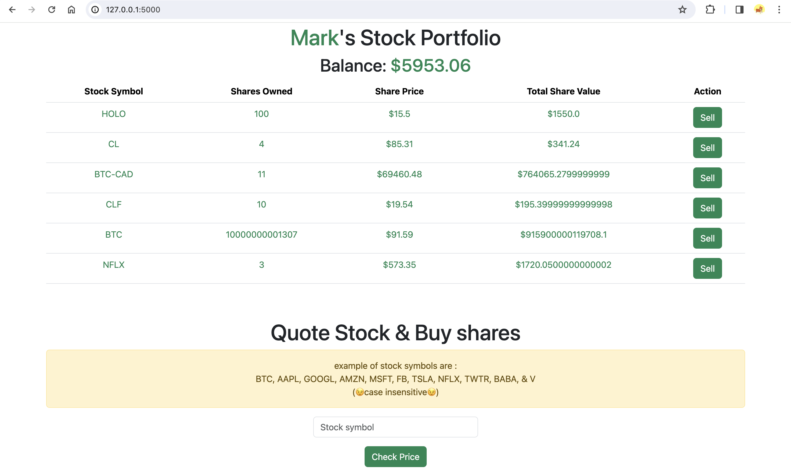

# Finance-application
 BetterFinance: Users trade stocks, manage funds, update login info. Real-time stock data from IEX API. Monitor portfolio, reset passwords.
 
 
 # Test software here

 [Demo Software Hosted @ pythonAnywhere](https://mkhmik004.pythonanywhere.com/)

 or 

 watch @ https://youtu.be/jXdBZutX_sc?si=zmvWf1Xr98DSe2XC

# Screenshot of software

# BetterFinance Documentation

BetterFinance is a robust web application designed to empower users with various financial activities. From trading stocks to managing funds, BetterFinance offers a comprehensive platform for financial management.

## Overview

BetterFinance allows registered users to perform the following actions:

- **Trade Stocks**: Buy and sell stocks to build and manage their investment portfolio.
- **Manage Funds**: Deposit and withdraw demo funds to simulate real financial transactions.
- **Update Login Information**: Users can update or reset their login credentials for enhanced security.
- **Real-time Stock Data**: The application fetches real-time stock quotes from the IEX API, providing users with accurate data for informed decision-making.
- **Portfolio Monitoring**: Users can conveniently monitor their stock portfolio and review transaction history to stay informed about their financial activities.

## Installation

To install BetterFinance, follow these steps:

1. Clone the repository:
2. install depandancies
3. run flask app
